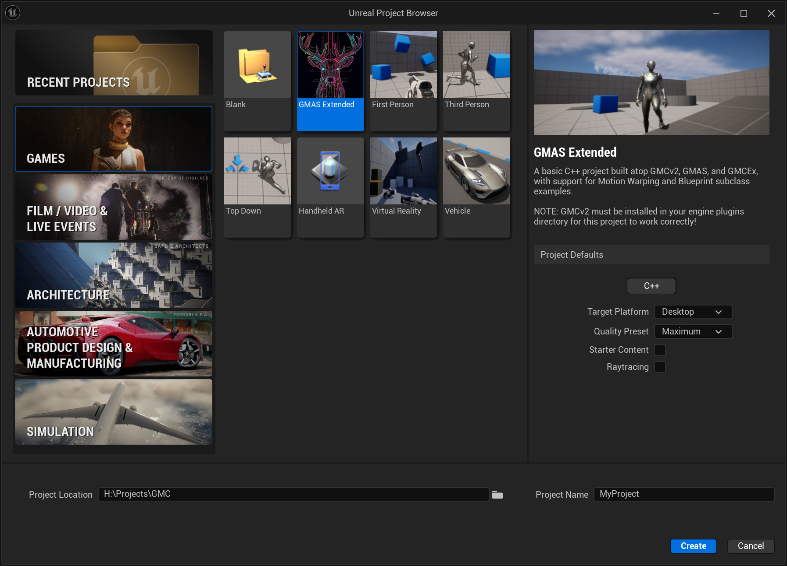

# GMAS Extended

This project is meant to provide a very basic starting point for a game built atop the **paid** [General Movement Component v2](https://www.unrealengine.com/marketplace/en-US/product/general-movement-component) movement and networking system for Unreal 5 (hereafter referred to as **GMCv2**), along with the free and open source [GMC Ability System](https://github.com/Reznok/GMCAbilitySystem) (or **GMAS**) and [GMCExtended framework](https://github.com/Rooibot/GMCExtended) (or **GMCEx**).

It is worth noting this is not meant to be a full foundation for a game—certainly not something along the scope of the `LyraSampleGame` project, or the venerable `ShooterGame` from the UE4 era. Think of this template as akin to the `ThirdPerson` or `FirstPerson` templates you can create a new Unreal project from: it doesn't do much, but it should hopefully be enough to get you started.

It is *also* worth noting that this project is still *very much* under construction. It will get you up and running with GMAS and GMCEx in one go, but it does not do a lot else yet. When time permits, more will be added.

## Basic Features

This template tries to exercise a few basic features across all parts of the ecosystem, as well as having some convenience classes already made:

* A baseline Pawn class (in C++) which provides both the interface required by GMCEx's motion warping functionality _and_ has components already provided and hooked up, as well as a skeletal mesh and camera for third-person functionality.
* A baseline movement component in C++ integrating all the bits required for GMAS to work and all the GMCEx functionality.
* Example blueprint subclasses for each of the above.

In addition, the project comes with a couple of GMAS abilities (Jump, Roll, and Sprint) already provided.

This template does not attempt to exercise every bit of functionality in all three pieces; it currently makes no use of GMCEx's motion warping (though has all the pieces in place to support it), for instance, nor does it dive into more advanced bits of GMAS or GMCv2. Consider it a starting place, nothing more.

## Installation

### Prerequisites

In order to install the latest version of this template, you will want to have a Git client available. While there will be bundled release .zip files eventually, currently you must pull from the repository. If you don't currently have a client installed, you'll want to pull it down from https://git-scm.com/downloads and install it.

You will also need the most recent version of the General Movement Component installed to your Unreal Engine installation, *or* you will want to be prepared to add it to the project manually after you set it up; if you don't have it installed to the engine, then the first attempt to open the project after creating it will fail, as noted below.+

### Installation Process

Find where your copy of Unreal 5.4 is installed -- on Windows, by default this is `C:\Program Files\Epic Games\UE_5.3` though obviously your copy may be installed somewhere else.

Once you've located your Unreal 5.4 install directory:

1. Make sure that you've installed GMCv2 into 5.4 from the Epic launcher.
  * **NOTE:** You _can_ install the plugin directly into the final project, just be aware that if you don't have GMCv2 in your 5.4 engine install, the project _will_ fail to open the first time.
2. Open a command prompt, such as the Windows `cmd.exe`.
3. Go to the Unreal Engine 5.4 installation directory you've located; if using `cmd.exe` you would do `cd <directory>`, for instance `cd "C:\Program Files\Epic Games\UE_5.4"` -- notice that if there are spaces in the path anywhere, you will want to put the path in quotes.
4. Type `git clone --recursive https://github.com/Rooibot/GMASExTemplate.git` and wait for the command to finish. This will pull not only the GMASEx template but also appropriate versions of GMAS and GMCEx.

This will pull the base template _and_ the appropriate copies of GMAS and GMCEx all in one go.

### Usage

Once you've installed the template as described above, you can launch Unreal 5.3 from the launcher and you'll see that under "Games" a new template is available:

When you select the template and create a new project, it will attempt to build the project from source. If you do not have GMCv2 installed to the engine _this will fail_. If so, abort the process and go to the project you just made, then copy GMCv2 into the `Plugins` directory under the project and attempt to build again.

## Project Layout

Once you have the project open, you'll find that in addition to the usual Unreal `Characters` folder, there is a `GMASExtended` folder containing the template's assets. Under that folder are several more:

* **Abilities**: This folder contains example blueprint implementations of three GMAS abilities (Jump, Roll, and Sprint).
* **Animations**: While most of the animation sequences (and the meshes and control rigs) are pulled from the default Unreal character package, the montage used for the "Roll" command and the animation blueprint for our default pawn can be found here.
* **Blueprints**: The `BP_ExamplePawn` used by this project can be found here, along with the `BP_ExampleMovement` component.
* **Data**: This contains the data assets used by the project. The two `DA_` assets are GMAS-defined formats, while the `DT_` is an Unreal data table defining what gameplay tags are available.
* **Effects**: This directory contains blueprint implementations of all the GMAS gameplay effects used by this demo (and some which are not).
* **Input**: This template is built atop Unreal's newer "Enhanced Input" system; all the Input Actions (and the default Input Mapping Context) can be found in this directory.
* **LevelPrototyping**: This just contains all the building blocks of the oh-so-familiar default Unreal 5 map.
* **Maps**: This contains the project's copy of the aforementioned default Unreal 5 map.
* **Particles**: This contains some Niagara particle systems utilized by gameplay effects (though at present none of those effects are used in the template).

## Common Questions

### Where is input being handled?

For the main movement and camera controls, GMCv2 can handle the basics internally. If you look at the `BP_ExampleMovement` blueprint component, you'll see that `IA_Look` and `IA_Movement` are set in the two input action properties.

The actual mapping that defines what those inputs are bound to is in the `IMC_Default` file in the Input folder; if you look at `BP_ExamplePawn` you'll see that this project's pawn will automatically use an input mapping context if one is set in its properties, and the default pawn is set to use `IMC_Default`.

You will also see a number of `IA_<whatever>` events in the default pawn; these events are called when a given input action is triggered. This is how the Jump, Sprint, and Roll abilities get called.

### How do I change the player pawn's movement behavior?

In addition to GMC's normal "Orient to Input Direction" or "Orient to Control Direction", GMCEx adds a few other features, notably "Orient to Velocity Direction" (where the way the character is facing is determined by your velocity). This is on by default in the template.

GMCEx also has a turn-in-place assist logic, which is "Require Facing Before Move" (with a "Facing Angle Offset Threshold"); if this is true, then the character will turn until they are within the offset threshold of the direction they're trying to move, and *then* they will start moving. This is coupled with a `GetAimYawRemaining` function which will tell you how much is still left in the turn. (Which is already cached and made available in the animation blueprint.)

## Potential TODO List

### Basic Functionality

Most of the rest of the GMAS demo functionality needs to still be ported in -- roll, crouch, and the more advanced abilities like teleport and whatnot. This is relatively straightforward.

### Animation

Internally right now, GMCEx has a bunch of additional animation functionality being added on -- precalculating orientation warping, things like that. Once I've finished those and pushed them live, I intend to convert the project to using those. I also intend to add some examples of how to use the motion warping functionality in GMCExtended. Which brings us to...

### Solvers

Yeah, *everyone* asks me about this. For those who aren't aware, I created a movement system for my game based around little blocks of movement logic -- things which could solve "can I climb this" and handle how you would climb, for instance -- which could be added and removed on-the-fly. It's worked very well for me, but many people asked about the Solvers on the GMC Discord. As a result, I've ported the base solver functionality into GMCEx... but there are currently no examples of how to *use* solvers, because all of my solvers are too heavily tied to my game code.

Adding a climbing/mantling or wall-running solver is definitely on the list to do eventually, especially as it'll serve as a useful example of how to use the motion warping functionality.